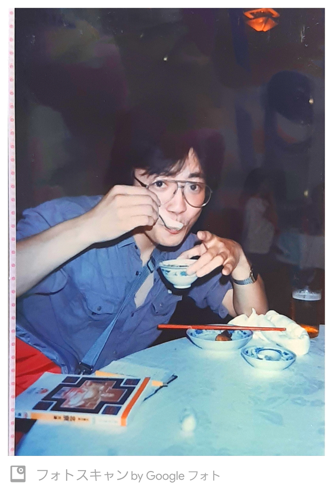

# 1987_Beijing

<html lang="ja">
 <head>
 <meta charset="UTF-8">
 <meta http-equiv="X-UA-Compatible" content="IE=EmulateIE10" />
 <title>再スタート</title>

<link href="https://cdnjs.cloudflare.com/ajax/libs/lightbox2/2.7.1/css/lightbox.css" rel="stylesheet">

</head>

<body onload="alert('北京２泊３日旅行！')" onunload="alert('若かった時の記録〜(^o^)/')">

  モバイル端末をお使いの場合は、画面を横向きにすると
  より見やすくご覧頂けます。

	
<h1><marquee behavior="left">!!! 1987年6月19日~21日_北京2泊3日旅行の記録 !!!</marquee></h1>
                               

2023年12月8日、いつもの湯西川温泉お泊まり会に岡が持ち込んだ紙のアルバム、 保存状態が良好でその場で野口さんがスマホでキャプチャー。 そのままLINE共有されましたので、そのデータでHP化しました。

 
      
&#160;
 
&#160;
 
&#160;
 
&#160;
 
&#160;
 
&#160;
 
&#160;

 <!--     <section>
<h2>おまけ、宇都宮とさいたまの天気予報（ときどき上下が入れ替わるので注意！）</h2>

assembled by <a href="http://mamewaza.com/tools/" target="_blank" rel="nofollow">まめわざ</a>

 
 

assembled by <a href="http://mamewaza.com/tools/" target="_blank" rel="nofollow">まめわざ</a>

</section>-->
<!--      <section>
<h2>気象庁、高解像度降水ナウキャスト</h2>
 <iframe src="https://www.jma.go.jp/jp/highresorad/" width="600" height="450" frameborder="0" style="border:0" allowfullscreen></iframe>
       </section>-->
   
&#160;

       
       

&#160;

&#160;

&#160;

&#160;

&#160;

&#160;

&#160;

&#160;

&#160;

       
&#160;

&#160;

&#160;

&#160;

&#160;

&#160;

&#160;

&#160;

 

<!-- フッタ -->
 <footer>
	Copyright 2023/12/16 S.Hada
 </footer>
